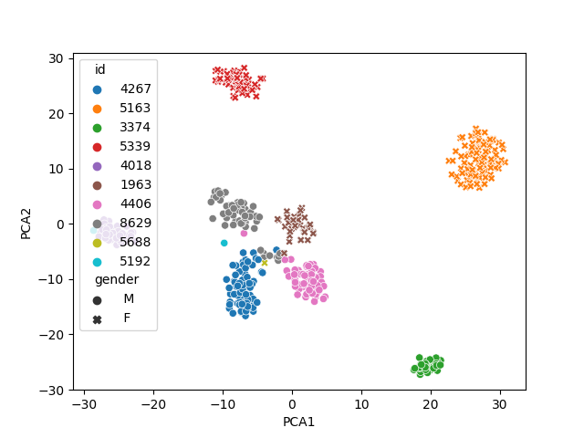

# One shot conversion with a VAE

---
layout: default
---
This is the demo page for the paper [One-shot Voice Conversion by Separating Speaker and Content Representations with Instance Normalization](https://arxiv.org/abs/1904.05742)
 
Voice conversion is the task of altering the voice of a speaker without changing the linguistic content. 
The typical set-up of this problem defines a source speaker who provides a sample of speech, and a target speaker 
whose voice will be used to reconstruct the source speaker's speech. A one-shot approach is when the model is only
supplied with one example of the source speaker, and one example of the target speaker. Neither of the source, nor 
target speakers need to be represented inside the training dataset. One-shot voice conversion
represents one of the most useful and challenging tasks in the VC domain: it requires minimal examples from a target 
speaker and also poses the least constraints on this example's content.

## Baseline Architecture

We adapt a modified variational autoencoder as proposed in the paper [One-shot VC with IN](https://arxiv.org/abs/1904.05742). The architecutre has two separate encoders: Speaker encoder for encoding the speaker voice style and Content Encoder for encoding the linguistic content in an audio. A single decoder is used with an Adaptive Instance Normalization layer (AdaIN). AdaIN layer is used to provide gloabl information which got normalized in the Content Encoder with Instance Normalization (IN). It realigns channel mean and variance of content features to style features. Mathematically, AdaIn is equivalent to IN of content input 𝑥 is normalized to style input 𝑦. The encoder and decoder arhcitectures are as follows:

## Architecture 1: 

## Training

The Libri dataset is curated for the voice conversion task, including
speech recordings of 100 hours of speech from English speakers exhibiting various accents. Each speaker within
the dataset has multiple audio recordings, each labelled with number that identifies the speaker.

We train our model by using the same audio clip for source, target, and desired output.

Training time for our smaller model (with three decoder layers) was as low as 2 hours on a Nvidia T4 GPU, taking 
approximately 45 thousand epochs.

## Initial results and demos

First, lets see some audio clips that we will use, including one example from the training dataset, and one from
each of James and Anery (the project undertakers).
- - -
#### *Training Sample*
<audio src="demos/audio/good_latent_5163.wav" controls preload></audio>
#### *Anery*
<audio src="demos/audio/anery_long.wav" controls preload></audio>
#### *James*
<audio src="demos/audio/james.wav" controls preload></audio>
- - -

And now some demos of the voice converter at work...

#### *Anery to Training Sample*
<audio src="demos/base/anery_to_5163.wav" controls preload></audio>
#### *James to Anery*
<audio src="demos/base/james_to_anery.wav" controls preload></audio>
#### *Anery to James*
<audio src="demos/base/anery_to_james1.wav" controls preload></audio>
- - -

We can hear that our baseline model, with three decoder layers, is performing the expected task. First, I would like
to point out why we chose the particular training sample given above. To do this, we look at the t-SNE components of 
the speaker encoder, for different speakers in the training data.

