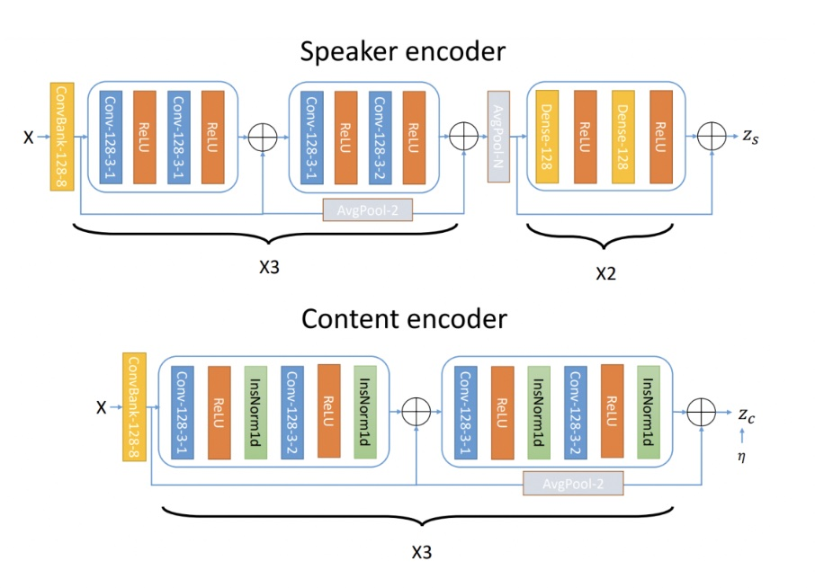
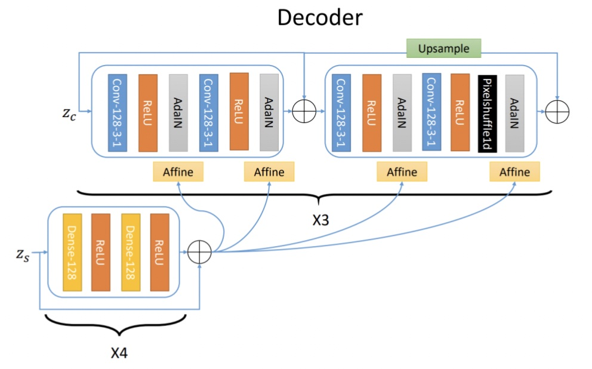
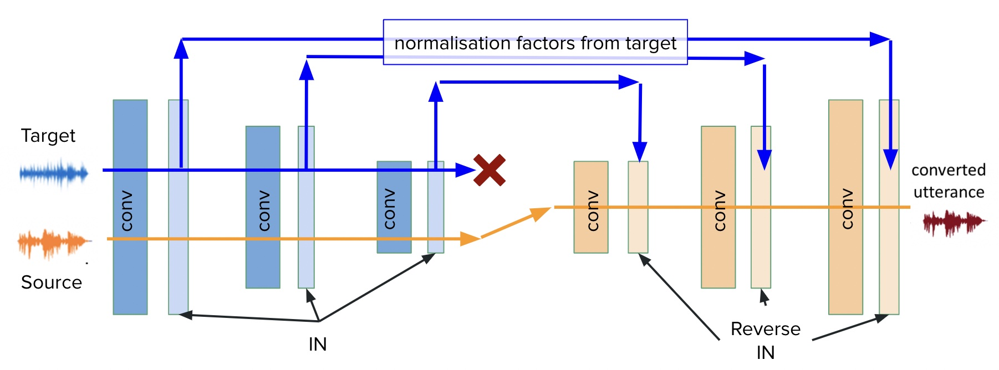

# One shot conversion with a VAE

Voice conversion is the task of altering the voice of a speaker without changing the linguistic content. The typical set-up of this problem defines a source speaker who provides a sample of speech, and a target speaker whose voice will be used to reconstruct the source speaker's speech. A one-shot approach is when the model is only supplied with one example of the source speaker, and one example of the target speaker. Neither of the source, nor  target speakers need to be represented inside the training dataset. One-shot voice conversion represents one of the most useful and challenging tasks in the VC domain: it requires minimal examples from a target speaker and also poses the least constraints on this example's content.

The task of voice conversion, albeit chosen out of curiosity and for its novelty, has proved to be useful in communication aids for the speech-impaired, voice-overs for movies, speech synthesis for navigation apps and personal voice assistants like Alexa, Siri, creating voice greetings, and synthesizing speech in the local accent to mention a few.

## Baseline Architecture

We adapt a modified variational autoencoder as proposed in the paper [One-shot VC with IN](https://arxiv.org/abs/1904.05742). The architecutre has two separate encoders: Speaker encoder for encoding the speaker voice style and Content Encoder for encoding the linguistic content in an audio. A single decoder is used with an Adaptive Instance Normalization layer (AdaIN). AdaIN layer is used to provide gloabl information which got normalized in the Content Encoder with Instance Normalization (IN). It realigns channel mean and variance of content features to style features. Mathematically, AdaIn is equivalent to IN of content input 𝑥 which is then normalized to style input 𝑦. The encoder and decoder arhcitectures are as follows:

 
 

## Training

The Libri dataset is curated for the voice conversion task, including
speech recordings of 100 hours of speech from English speakers exhibiting various accents. Each speaker within
the dataset has multiple audio recordings, each labelled with number that identifies the speaker.

We train our model by using the same audio clip for source, target, and desired output. 
Training time for our smaller model (with three decoder layers) was as low as 2 hours on a Nvidia T4 GPU, taking 
approximately 45 thousand epochs.

## Visualising Speaker Encoder Latent Space

We extract the embeddings learnt by the speaker encoder, reduce the dimensionality using t-SNE algorithm and visualise the embedding space learnt for different speakers. We notice that some speaker voices are very distinct than the others. We pick a sample audio from a speaker that has a distinct embedding for the subsequent experiments. 
 

## Initial results and demos

With our model trained on the Libri dataset, we can start inference. 

First, let's look at converting some audio clips that come from the authors of this project (Anery and James). Here 
are two audio clips that we can use.

### *Anery*
<audio src="/demos/audio/anery_long.wav" controls preload></audio>
### *James*
<audio src="/demos/audio/james.wav" controls preload></audio>

And the results, converting between the two of us, are as follows:

### *James to Anery*
<audio src="/demos/base/james_to_anery.wav" controls preload></audio>
### *Anery to James*
<audio src="/demos/base/anery_to_james1.wav" controls preload></audio>
### *James to James*
<audio src="/demos/base/james_to_james.wav" controls preload></audio>

Overall these conversions are a great start. But there is room for improvement. Searching for an example that will
exemplify the best of the model, we search for a target speaker inside the training data. To do this, we look back at
the latent space of the speaker encoder, in the previous figure. We take an audio clip from the speaker with ID 5163, which
our t-SNE analysis showed could have a nicely distinct location in the speaker encoder's latent space. 

### *Anery to Speaker 5163*
<audio src="/demos/base/anery_to_5163.wav" controls preload></audio>

And one more fun example
### *James to Tuba*
<audio src="/demos/base/james_to_tuba.wav" controls preload></audio>

## Architecture 1: 
We notice from the previous demos that the speaker style is not perfectly imposed on the content embeddings from the Content Encoder. In order to boost style element in the output, we experiment with a deeper Decoder network so as to incorporate more AdaIn layers, the primary point of style injection in the network. We test this hypothesis with two networks: a Decoder with 5 layers and a Decoder with 7 layers

### *5 layer decoder*
<audio src="/demos/decoders/james_to_anery5_1.wav" controls preload></audio>

### *7 layer decoder*
<audio src="/demos/decoders/james_to_anery7_1.wav" controls preload></audio>

## Architecture 2:
Since normalization layer is the primary reason for style diffusion or injection into the network, we perform ablation on IN layers in the Content Encoder to test its effectiveness. 

## Architecture 3: 
We modify the network to use the Content encoder for both the source and target audios. During forward pass of the target, we save the IN normalisation factors that gets injected in the subsequent decoder stages in place of AdaIN. It works like a mirrored network. Whatever style Content Encoder rejects when processing the target audio is then fed to the decoder for adding style to the output audio.

 

## Futurework

1. Use a deeper network and train it for a longer period
2. Use more diverse training dataset to include speech in different accents
3. Modify the architecture to have adjustable style combination post-training
4. Better Decoding using Wavenets and more advanced networks

- - -
### *Male to male(p237->p292)*
- - -
#### *Source*
<audio src="res/demo/p237_p292_M_M/p237_018_p292_155_src.wav" controls preload></audio>
#### *Target*
<audio src="res/demo/p237_p292_M_M/p237_018_p292_155_tar.wav" controls preload></audio>
#### *Converted*
<audio src="res/demo/p237_p292_M_M/p237_018_p292_155_con.wav" controls preload></audio>
- - -
#### *Source*
<audio src="res/demo/p237_p292_M_M/p237_087_p292_162_src.wav" controls preload></audio>
#### *Target*
<audio src="res/demo/p237_p292_M_M/p237_087_p292_162_tar.wav" controls preload></audio>
#### *Converted*
<audio src="res/demo/p237_p292_M_M/p237_087_p292_162_con.wav" controls preload></audio>
- - -
#### *Source*
<audio src="res/demo/p237_p292_M_M/p237_171_p292_407_src.wav" controls preload></audio>
#### *Target*
<audio src="res/demo/p237_p292_M_M/p237_171_p292_407_tar.wav" controls preload></audio>
#### *Converted*
<audio src="res/demo/p237_p292_M_M/p237_171_p292_407_con.wav" controls preload></audio>
- - -
### *Female to male(p262->p256)*
- - -
#### *Source*
<audio src="res/demo/p262_p256_F_M/p262_027_p256_150_src.wav" controls preload></audio>
#### *Target*
<audio src="res/demo/p262_p256_F_M/p262_027_p256_150_tar.wav" controls preload></audio>
#### *Converted*
<audio src="res/demo/p262_p256_F_M/p262_027_p256_150_con.wav" controls preload></audio>
- - -
#### *Source*
<audio src="res/demo/p262_p256_F_M/p262_056_p256_116_src.wav" controls preload></audio>
#### *Target*
<audio src="res/demo/p262_p256_F_M/p262_056_p256_116_tar.wav" controls preload></audio>
#### *Converted*
<audio src="res/demo/p262_p256_F_M/p262_056_p256_116_con.wav" controls preload></audio>
- - -
#### *Source*
<audio src="res/demo/p262_p256_F_M/p262_083_p256_101_src.wav" controls preload></audio>
#### *Target*
<audio src="res/demo/p262_p256_F_M/p262_083_p256_101_tar.wav" controls preload></audio>
#### *Converted*
<audio src="res/demo/p262_p256_F_M/p262_083_p256_101_con.wav" controls preload></audio>
- - -
### *Female to female(p276->p294)*
- - -
#### *Source*
<audio src="res/demo/p276_p294_F_F/p276_064_p294_069_src.wav" controls preload></audio>
#### *Target*
<audio src="res/demo/p276_p294_F_F/p276_064_p294_069_tar.wav" controls preload></audio>
#### *Converted*
<audio src="res/demo/p276_p294_F_F/p276_064_p294_069_con.wav" controls preload></audio>
- - -
#### *Source*
<audio src="res/demo/p276_p294_F_F/p276_162_p294_250_src.wav" controls preload></audio>
#### *Target*
<audio src="res/demo/p276_p294_F_F/p276_162_p294_250_tar.wav" controls preload></audio>
#### *Converted*
<audio src="res/demo/p276_p294_F_F/p276_162_p294_250_con.wav" controls preload></audio>
- - -
#### *Source*
<audio src="res/demo/p276_p294_F_F/p276_225_p294_114_src.wav" controls preload></audio>
#### *Target*
<audio src="res/demo/p276_p294_F_F/p276_225_p294_114_tar.wav" controls preload></audio>
#### *Converted*
<audio src="res/demo/p276_p294_F_F/p276_225_p294_114_con.wav" controls preload></audio>
- - -
- - -
### *Male to female(p278->p310)*
- - -
#### *Source*
<audio src="res/demo/p278_p310_M_F/p278_047_p310_324_src.wav" controls preload></audio>
#### *Target*
<audio src="res/demo/p278_p310_M_F/p278_047_p310_324_tar.wav" controls preload></audio>
#### *Converted*
<audio src="res/demo/p278_p310_M_F/p278_047_p310_324_con.wav" controls preload></audio>
- - -
#### *Source*
<audio src="res/demo/p278_p310_M_F/p278_053_p310_141_src.wav" controls preload></audio>
#### *Target*
<audio src="res/demo/p278_p310_M_F/p278_053_p310_141_tar.wav" controls preload></audio>
#### *Converted*
<audio src="res/demo/p278_p310_M_F/p278_053_p310_141_con.wav" controls preload></audio>
- - -
#### *Source*
<audio src="res/demo/p278_p310_M_F/p278_101_p310_343_src.wav" controls preload></audio>
#### *Target*
<audio src="res/demo/p278_p310_M_F/p278_101_p310_343_tar.wav" controls preload></audio>
#### *Converted*
<audio src="res/demo/p278_p310_M_F/p278_101_p310_343_con.wav" controls preload></audio>
- - -
